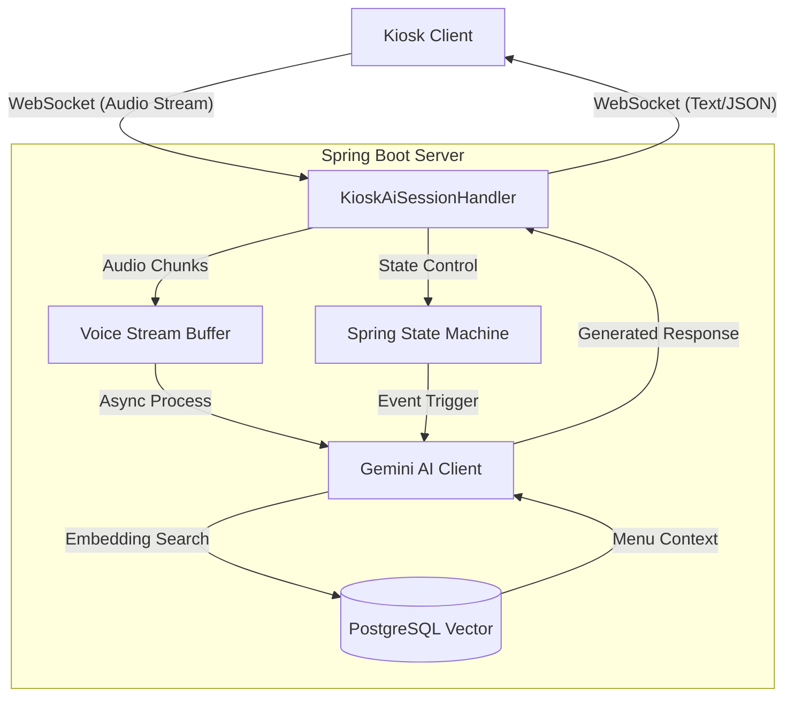

# 🎙️ Voice-First AI Kiosk Backend (Capstone Project)

> **"터치보다 쉬운 대화, 사람보다 똑똑한 주문"**
>
> 생성형 AI(Gemini)와 실시간 음성 스트리밍 기술을 활용한 **대화형 키오스크 백엔드 시스템**입니다.
> 기존 키오스크의 복잡한 UI/UX로 인한 '디지털 소외 계층' 문제를 해결하고, 자연스러운 대화 흐름을 통해 새로운 주문 경험을 제공합니다.

---

## 📖 목차
1. [프로젝트 개요 (Project Overview)](#-프로젝트-개요-project-overview)
2. [시스템 아키텍처 (System Architecture)](#-시스템-아키텍처-system-architecture)
3. [핵심 기술 스택 (Tech Stack)](#-핵심-기술-스택-tech-stack)
4. [기술적 도전과 해결 (Technical Challenges)](#-기술적-도전과-해결-technical-challenges-interview-highlights)
   - [1. 실시간 음성 스트리밍 처리](#1-실시간-음성-스트리밍과-비동기-처리-websocket--kotlin-coroutines)
   - [2. 대화 흐름 제어와 환각 방지](#2-대화-상태-관리-spring-state-machine)
   - [3. 도메인 특화 응답 생성](#3-rag-기반-메뉴-추천-postgresql-vector--gemini)
5. [프로젝트 구조 (Project Structure)](#-프로젝트-구조-project-structure)
6. [시작하기 (Getting Started)](#-시작하기-getting-started)

---

## 🧐 프로젝트 개요 (Project Overview)
기존의 터치 기반 키오스크는 노년층이나 디지털 취약 계층에게 높은 진입 장벽이었습니다. 본 프로젝트는 **사용자의 음성을 실시간으로 분석하여 의도를 파악하고, 메뉴 추천부터 결제까지 대화로 완료할 수 있는 백엔드 API**를 구축했습니다.

- **핵심 기능**:
  - 웹소켓 기반 실시간 음성 데이터 수신 및 처리
  - LLM(gemini-2.5-flash-native-audio-preview-09-2025)을 활용한 자연어 이해 및 의도 파악
  - 벡터 검색(RAG)을 통한 정확한 메뉴 정보 및 매장 정보 제공
  - 상태 머신(State Machine)을 이용한 견고한 대화 세션 관리

---

## 🏗 시스템 아키텍처 (System Architecture)



---

## 🛠 핵심 기술 스택 (Tech Stack)

이 프로젝트는 **최신 기술 트렌드**를 반영하여, 고성능 비동기 처리와 확장성을 고려해 설계되었습니다.

| Category | Tech | Version | Selection Reason |
| --- | --- | --- | --- |
| **Language** | **Kotlin** | 2.2.0 | Null Safety와 Coroutines를 통한 비동기 처리 효율성 극대화 |
| **Framework** | **Spring Boot** | 3.5.4 | 최신 스프링 생태계 활용 및 안정적인 의존성 관리 |
| **AI Model** | **Google Gemini** | gemini-2.5-flash-native-audio-preview-09-2025 | 멀티모달 처리 능력과 빠른 응답 속도 (via `google-genai`) |
| **Async** | **Kotlin Coroutines** | - | Non-blocking I/O 및 경량 스레드 기반의 동시성 제어 |
| **Protocol** | **WebSocket** | - | 실시간 양방향 음성/데이터 통신 |
| **State Mgmt** | **Spring State Machine** | 4.0.1 | 복잡한 대화 시나리오의 상태 전이 제어 및 예외 상황 방지 |
| **Database** | **PostgreSQL** | - | 관계형 데이터와 벡터 데이터(`hibernate-vector`)의 단일 저장소 관리 |
| **Security** | **Spring Security** | - | JWT 및 OAuth2 기반 인증/인가 |

---

## 💡 기술적 도전과 해결 (Technical Challenges: Interview Highlights)

### 1. 실시간 음성 스트리밍과 비동기 처리 (WebSocket + Kotlin Coroutines)
- **문제:** 사용자의 음성을 파일로 업로드받아 처리하면 응답 지연(Latency)이 발생하여 실시간 대화 경험을 저해함.
- **해결:**
  - **WebSocket**을 통해 오디오 데이터를 청크(Chunk) 단위로 스트리밍 수신.
  - **Kotlin Coroutines (`SharedFlow`, `CompletableDeferred`)**를 사용하여 블로킹 없이 수신된 청크를 버퍼링하고, VAD(Voice Activity Detection) 완료 시점에 즉시 AI 모델로 전송.
  - `BufferOverflow.DROP_OLDEST` 정책을 적용하여 메모리 누수 방지 및 최신 음성 데이터 우선 처리.

### 2. 대화 상태 관리 (Spring State Machine)
- **문제:** LLM은 기본적으로 상태가 없으며(Stateless), 사용자가 엉뚱한 말을 할 경우 대화의 맥락을 잃거나 환각(Hallucination) 현상이 발생할 수 있음. (예: 주문 중에 갑자기 날씨를 물어봄)
- **해결:**
  - **Spring State Machine**을 도입하여 대화 상태를 `LISTENING` -> `PROCESSING` -> `ORDERING` -> `CONFIRMING` 등으로 명확히 정의.
  - 현재 상태에서 허용된 이벤트(발화)만 처리하도록 강제하여, 예측 가능한 대화 흐름을 보장하고 비즈니스 로직의 안전성을 확보.

### 3. RAG 기반 메뉴 추천 (PostgreSQL Vector + Gemini)
- **문제:** LLM은 매장의 실시간 메뉴 정보나 재고 상황, 가격 변동을 알지 못함.
- **해결:**
  - 메뉴 이름, 설명, 카테고리 정보를 임베딩하여 **PostgreSQL(pgvector)**에 저장.
  - 사용자 질문이 들어오면 관련 메뉴를 벡터 유사도 검색(Hibernate Vector)으로 추출(Retrieval).
  - 추출된 정보를 프롬프트에 포함(Augmented)하여 Gemini에게 전달함으로써, **"아샷추(아이스티에 샷 추가) 있어요?"** 같은 질문에도 정확한 매장 메뉴 매핑이 가능하게 함.

---

## 📂 프로젝트 구조 (Project Structure)
도메인 주도 설계(DDD) 원칙을 일부 차용하여, 기능별로 패키지를 응집도 있게 구성했습니다.

```text
src/main/kotlin/jnu/ie/capstone
├── common      # 전역 예외 처리, 보안 설정, 유틸리티
├── gemini      # Gemini AI 클라이언트 및 프롬프트 설정
├── member      # 사용자/점주 관리 도메인
├── menu        # 메뉴 및 옵션 관리 (벡터 데이터 포함)
├── session     # WebSocket 세션 및 상태 머신 (핵심 로직)
└── store       # 매장 정보 관리
```

---

## 🚀 시작하기 (Getting Started)

### Prerequisites
- Java 21 (JDK 21)
- PostgreSQL (with `pgvector` extension enabled)
- Gemini API Key

### Installation & Run

1. **Clone the repository**
   ```bash
   git clone https://github.com/jnu-ie-capstone/backend.git
   ```

2. **Environment Setup**
   `src/main/resources/application.yml` 또는 환경 변수 설정:
   ```yaml
   gemini:
     api-key: "YOUR_GEMINI_API_KEY"
   spring:
     datasource:
       url: "jdbc:postgresql://localhost:5432/capstone"
       username: "postgres"
       password: "password"
   ```

3. **Build & Run**
   ```bash
   ./gradlew clean build
   ./gradlew bootRun
   ```

---

## 👨‍💻 Team
- **Developer:** [Your Name]
- **Role:** Backend Lead, AI Integration, System Architecture

---
*This project was developed as a Capstone Design project at Chonnam National University (JNU) Industrial Engineering.*
