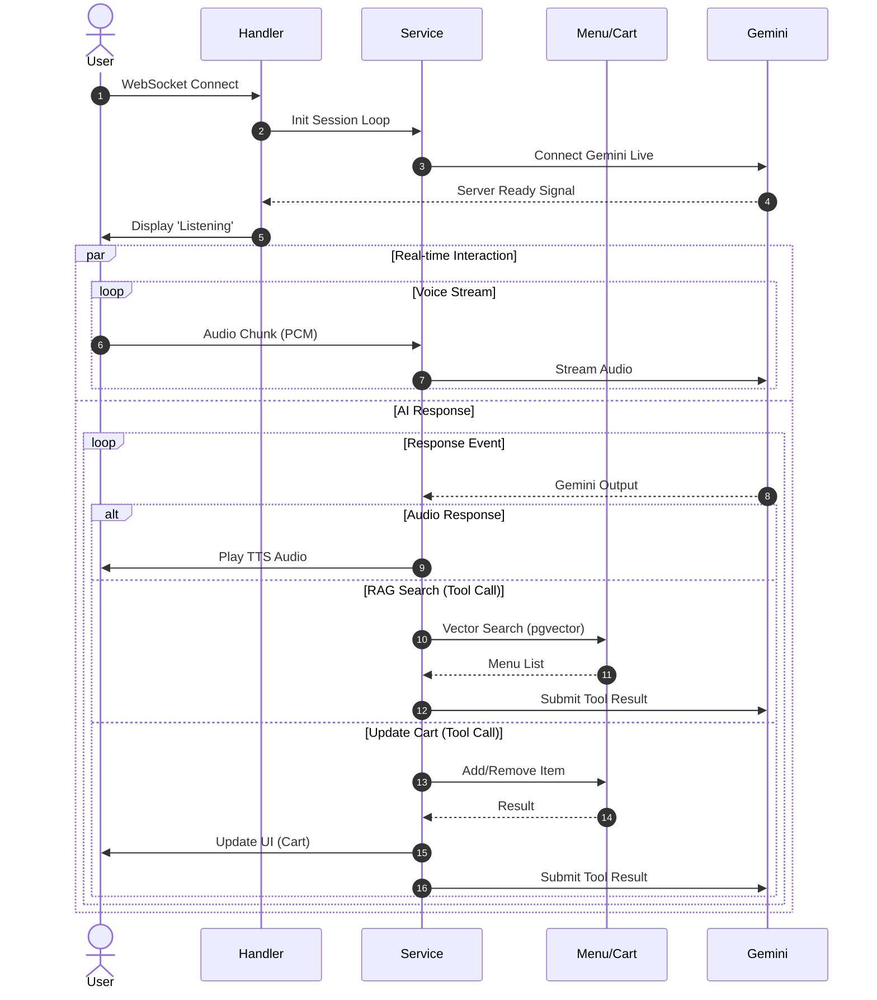
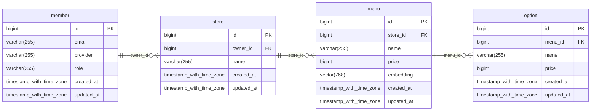

# 디지털 취약계층을 위한 대화형 음성 AI 에이전트 키오스크 구현

   

## 📖 프로젝트 소개 (Introduction)

본 프로젝트는 고령층 및 장애인 등 **디지털 취약계층**이 겪는 키오스크 사용의 어려움(Digital Divide)을 해결하고자 시도된 학술 연구입니다. 기존 터치 인터페이스의 복잡성을 보완하기 위해, **자연스러운 음성 대화**를 활용한 **자율형 AI 에이전트 키오스크** 프로토타입을 구현하였습니다.

**Google Gemini Live**의 실시간 멀티모달 상호작용과 **RAG(검색 증강 생성)** 기술을 접목하여, 사용자 의도를 파악하고 적절한 메뉴를 추천하는 시스템을 목표로 하였습니다.

### 💡 연구 배경 및 목표
- **접근성 향상**: 복잡한 UI 학습 없이 음성만으로 주문 가능한 환경 모색.
- **유연한 상호작용**: 정형화된 버튼 조작의 한계를 넘어, 자연어 대화를 통한 주문 처리 시도.
- **신뢰성 확보**: 생성형 AI의 고질적인 **환각(Hallucination) 현상**을 **State Machine**과 **RAG**를 통해 **완화**하고자 노력함.

---

## ✨ 주요 기능 (Key Features)

### 1. 자율형 AI 에이전트 (Autonomous AI Agent)
단순 질의응답을 넘어, 주문 목표 달성을 위해 스스로 판단하는 에이전트 구조를 지향합니다.
- **도구 사용**: 사용자의 발화에 따라 **메뉴 검색(RAG)**과 **장바구니 담기(Function Call)** 중 적절한 행동을 선택합니다.
- **흐름 제어**: **메뉴 선택** → **결제 확인** → **완료**로 이어지는 주문 프로세스를 관리합니다.

### 2. 실시간 멀티모달 스트리밍 (Gemini Live)
- **Native Audio**: 음성을 텍스트로 변환하지 않고 모델이 직접 듣고 이해하는 방식을 사용하여, 기존 파이프라인(STT-LLM-TTS) 대비 지연 시간을 단축하였습니다.
- **이중 입력 전략 (Dual-Input Strategy)**: 음성 데이터(Fast Path)와 시스템 컨텍스트(Slow Path)를 분리 처리하여 평균 응답 속도 **2.74초**를 달성하였습니다.

### 3. 의미 기반 메뉴 검색 (pgvector RAG)
- **벡터 검색**: `pgvector`와 `Hibernate Vector`를 활용하여 단순히 메뉴명이 일치하지 않아도, 의미적으로 유사한 메뉴를 추천합니다. (예: "초록초록한 거" → "말차 프라푸치노")

### 4. 상태 기반 안전장치 (Spring State Machine)
- AI의 예측 불가능한 행동을 제어하기 위해, 상태 머신을 도입하여 각 단계에서 허용된 발화와 행동만을 수행하도록 제한하였습니다.

---

## ⚠️ 한계점 (Limitations)

본 시스템은 프로토타입 단계로, 다음과 같은 기술적 한계가 존재합니다.

1.  **잔존하는 환각 현상 (Residual Hallucinations)**: RAG와 프롬프트 엔지니어링을 통해 환각을 억제했으나, LLM의 확률적 특성상 간혹 의도와 다른 메뉴를 담거나 도구 호출을 누락하는 오류가 발생할 수 있습니다 (성공률 95%).
2.  **도구의 제한**: 현재는 `추가`와 `삭제` 기능만 구현되어 있어, "방금 넣은 거에서 샷 빼줘"와 같은 복잡한 옵션 수정(`UPDATE`)에는 한계가 있습니다.
3.  **실증 평가의 부재**: 실험 환경에서의 벤치마크 테스트는 수행하였으나, 실제 디지털 취약계층(고령층 등)을 대상으로 한 사용성 평가(Usability Test)는 수행되지 않았습니다.

---

## API 명세
- **API 명세서 (Notion)**: [바로가기](https://spectacled-knight-5db.notion.site/API-28e399dcba9280008cd8f9008b04abcf?p=295399dcba9281a386baf76042c271ab&pm=s)

--- 
## 🏗 시스템 구성 (System Architecture)

### 🛠 기술 스택
| 구분            | 기술                                                   |
|---------------|------------------------------------------------------|
| **Language**  | **Kotlin 2.2.0**, **Java 21**                        |
| **Framework** | **Spring Boot 3.5.4**, WebFlux, Spring State Machine |
| **Database**  | **PostgreSQL 17** (pgvector)                         |
| **AI**        | **Google Gemini Live**                               |
| **Protocol**  | **WebSocket**                                        |

### 🔄 데이터 흐름 (Data Flow)


### 💾 데이터베이스 설계 (ER Diagram)


### 🧩 클래스 구조 (Class Diagram)

---

## 🚀 시작하기 (Getting Started)

### 사전 요구사항

* **Java 21**
* **Google AI Studio API Key**

### 1. 프로젝트 클론

```bash
git clone https://github.com/rdme0/jnu-ie-capstone-be.git
cd jnu-ie-capstone-be
```

### 2. 환경 변수 설정

프로젝트 루트 경로에 `.env` 파일을 생성하고, 아래 내용을 작성해 주세요.

```properties
# 1. Security & Auth
AES256_KEY=
JWT_SECRET_KEY=

# 2. OAuth (Kakao)
KAKAO_CLIENT_ID=
KAKAO_CLIENT_SECRET=

# 3. AI Service
GEMINI_API_KEY=

# 4. Server Configuration
DEV_URL=
PROD_URL=

# 5. Database (Development)
DEV_POSTGRES_URL=
DEV_POSTGRES_PORT=
DEV_POSTGRES_USERNAME=
DEV_POSTGRES_PASSWORD=
DEV_POSTGRES_DATABASE=

# 6. Database (Production)
PROD_POSTGRES_URL=
PROD_POSTGRES_PORT=
PROD_POSTGRES_USERNAME=
PROD_POSTGRES_PASSWORD=
PROD_POSTGRES_DATABASE=

```

### 3. 애플리케이션 실행

```bash
./gradlew bootRun
```

---

## 📊 성능 평가 (Performance)
- **평균 응답 속도**: 2.74초 (End-to-End)
- **주문 성공률**: 95% (100회 벤치마크 테스트 기준)
- **음성 처리**: 백프레셔(Backpressure) 제어가 적용된 128 청크 버퍼링.